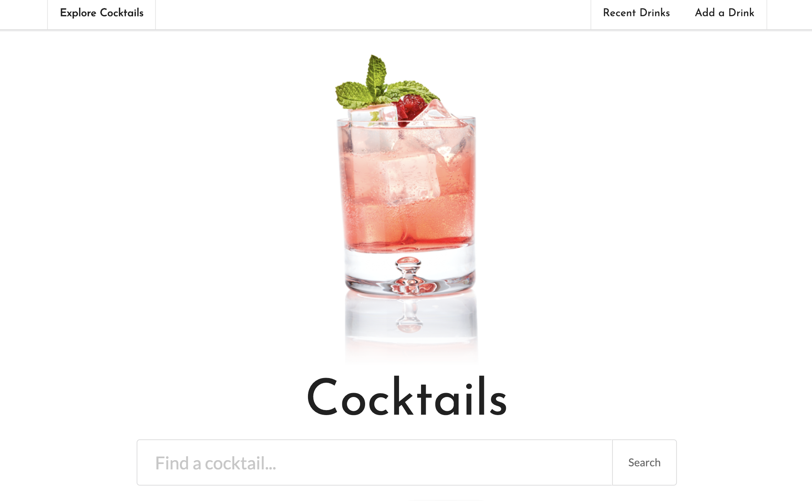

# Project 2 - Explore Cocktails
Project for UofO Full Stack Web Development Bootcamp

## Overview
Blah blah blah

## Technologies
* [Node.js](https://nodejs.org/en/)
* [JQuery](https://jquery.com/)
* [MySQL](https://www.mysql.com/)
* [Sequelize](https://sequelize.org/)
* [Express](https://expressjs.com/)
* [Heroku](https://www.heroku.com/)
* [JawsDB](https://www.jawsdb.com/)

## Links
Here is a link to our [application](https://team-project-02.herokuapp.com/) and project [presentation](https://dyhu.co/team-pro-02).

[Lauren Doss](https://github.com/laurendoss), [Ruvin](https://github.com/Ruvin12), and [Dylan Hulbert](https://github.com/dylanhulbert)

